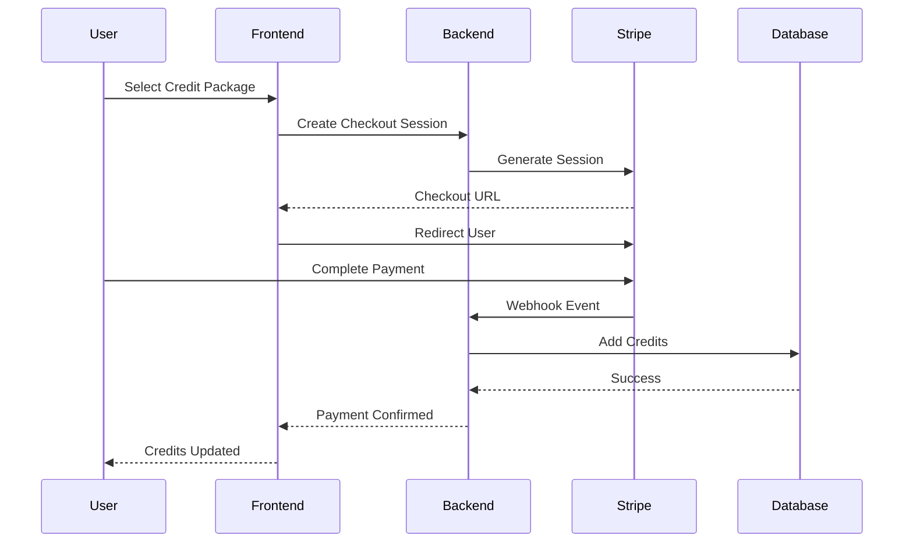
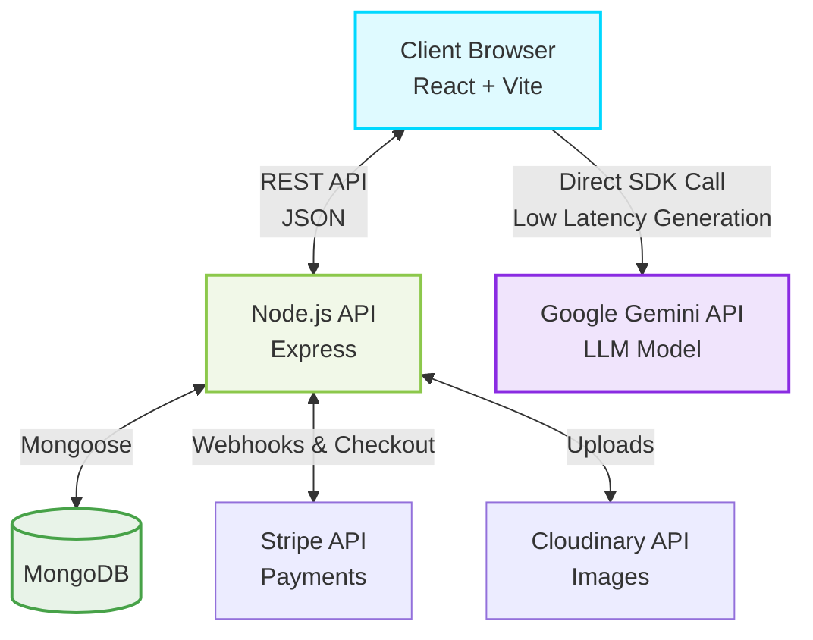

<div align="center">
  
  
  
  
  
  
  <h1 align="center">✨ Buildora AI ✨</h1>
  <p align="center">
    <strong>The Next-Gen AI Website Builder for Everyone.</strong><br/>
    Turn your ideas into production-ready code in seconds.
  </p>

  <p align="center">
    <a href="https://reactjs.org/"></a>
    <a href="https://deepmind.google/technologies/gemini/"></a>
    <a href="https://tailwindcss.com/"></a>
    
    
  </p>

  <h4>
    <a href="https://buildora.ai">View Demo</a>
    <span> · </span>
    <a href="#-quick-start">Documentation</a>
    <span> · </span>
    <a href="https://github.com/yourusername/buildora/issues">Report Bug</a>
  </h4>
</div>

---

## ⚡ Project Introduction

**Buildora AI** is a state-of-the-art **AI Website Builder SaaS** that empowers users to generate fully responsive, modern, and production-ready websites using simple text prompts. Built on the robust **MERN Stack (MongoDB, Express, React, Node.js)** and powered by **Google's Gemini API**, Buildora bridges the gap between idea and implementation.

Whether you're a developer prototyping ideas, a designer seeking inspiration, or a founder building a landing page, Buildora generates clean **HTML + Tailwind CSS + JavaScript** code in a single file, ready for download and deployment.

---

## 🚀 Key Features

### 🤖 AI-Powered Generation
* **Prompt-to-Website:** Advanced Natural Language Processing converts text descriptions into full website code.
* **Gemini 1.5 Flash Integration:** Ultra-fast generation speeds with high-quality, precise output.
* **Context-Aware Styling:** Understands complex requests for specific sections (Hero, Pricing, Contact) and distinct aesthetics (Modern, Minimal, Dark Mode, Neo-Brutalism).

### 🛠️ Advanced Builder Interface
* **Split-Screen View:** Real-time Chat/Prompt interface alongside a Live Preview.
* **Professional Editor:** Integrated Monaco Code Editor with syntax highlighting and auto-formatting.
* **Secure Sandbox Preview:** Instant visual rendering of generated code in a secure, isolated iframe.
* **One-Click Export:** Download your generated project instantly as an `index.html` file.

### 🔐 Secure & Scalable Backend
* **Robust Authentication:** JWT-based secure Signup, Login, and Session management.
* **Credit System Engine:** Usage-based model (Free tier allowances + Paid top-ups).
* **Media Management:** Cloudinary integration for scalable asset handling.

### 💳 Payments & Subscriptions
* **Stripe Integration:** Seamless, bank-grade payment processing for credit purchases.
* **Automated Webhooks:** Instant credit fulfillment upon successful transactions.
* **Transaction History:** Complete logs of user payments and credit usage tracking.

---

# 💳 Stripe Payment System

Buildora AI includes a fully integrated Stripe-powered billing infrastructure designed for secure credit purchases, subscription management, and automated payment processing.

### Features

* Secure Stripe Checkout Sessions
* One-Time Credit Purchases
* Subscription Plans (Monthly / Yearly)
* Automatic Credit Allocation
* Stripe Webhook Verification
* Payment Failure Handling
* Refund Tracking
* Transaction History
* Invoice Management
* Admin Revenue Dashboard
* User Billing Portal
* Real-Time Credit Updates

### Payment Flow



---

# 💰 Credit Packages

| Plan     | Credits      | Price |
| -------- | ------------ | ----- |
| Free     | 50 Credits   | ₹0    |
| Starter  | 250 Credits  | ₹199  |
| Pro      | 1000 Credits | ₹699  |
| Business | 5000 Credits | ₹2499 |

### Credit Consumption

| Feature               | Credit Cost |
| --------------------- | ----------- |
| Website Generation    | 5           |
| Website Regeneration  | 2           |
| AI Design Enhancement | 3           |
| Export HTML           | Free        |
| Export ZIP Project    | 2           |

---

# 🔐 Stripe Security

### Security Features

* Stripe Signature Verification
* Webhook Secret Validation
* JWT Protected Billing Routes
* Duplicate Payment Prevention
* Fraud Detection Support
* PCI DSS Compliant Processing
* Secure Server-side Secret Storage

### Important Environment Variables

```env
STRIPE_SECRET_KEY=sk_live_xxxxxxxxx
STRIPE_WEBHOOK_SECRET=whsec_xxxxxxxxx
STRIPE_PUBLISHABLE_KEY=pk_live_xxxxxxxxx
```

Never expose Secret Keys in frontend code.

---

# 🔄 Stripe Webhook Events

Buildora listens to the following Stripe events:

```javascript
checkout.session.completed
payment_intent.succeeded
payment_intent.failed
customer.subscription.created
customer.subscription.updated
customer.subscription.deleted
invoice.paid
invoice.payment_failed
charge.refunded
```

---

# 📂 Billing Database Structure

## User Model

```javascript
{
    name: String,
    email: String,
    credits: Number,
    subscription: String,
    stripeCustomerId: String
}
```

## Transaction Model

```javascript
{
    userId: ObjectId,
    stripeSessionId: String,
    amount: Number,
    creditsPurchased: Number,
    status: String,
    createdAt: Date
}
```

## Subscription Model

```javascript
{
    userId: ObjectId,
    stripeSubscriptionId: String,
    plan: String,
    status: String,
    currentPeriodEnd: Date
}
```

---

# 👨💼 Admin Revenue Dashboard

The Admin Panel includes:

### Revenue Analytics

* Total Revenue
* Monthly Revenue
* Daily Revenue
* Annual Revenue
* Active Subscriptions
* Credit Sales Metrics

### User Management

* Search Users
* Block / Unblock Users
* View Payment History
* Credit Adjustments
* Subscription Management

### Payment Monitoring

* Successful Payments
* Failed Payments
* Refund Requests
* Pending Transactions
* Stripe Event Logs

### Charts

* Revenue Trend Chart
* Subscription Growth
* Credit Usage Analytics
* Customer Retention Metrics

---

# 📊 Billing Analytics

Track:

* Average Revenue Per User (ARPU)
* Monthly Recurring Revenue (MRR)
* Annual Recurring Revenue (ARR)
* Churn Rate
* Customer Lifetime Value (CLTV)
* Conversion Rate

---

# 🚀 Stripe Checkout API

## Create Checkout Session

Endpoint:

```http
POST /api/payments/create-checkout-session
```

Response:

```json
{
    "checkoutUrl": "https://checkout.stripe.com/..."
}
```

---

# 🔔 Stripe Webhook Endpoint

Endpoint:

```http
POST /api/payments/webhook
```

Responsibilities:

* Verify Signature
* Validate Payment
* Allocate Credits
* Save Transaction
* Send Confirmation Email
* Update Dashboard Metrics

---

# 📧 Automated Email Notifications

Users receive:

* Payment Success Email
* Payment Failure Email
* Subscription Renewal Notice
* Credit Balance Updates
* Refund Confirmation

Integration Suggestions:

* Nodemailer
* Resend
* SendGrid

---

# 🌐 Production Deployment

### Frontend

* Vercel
* Netlify

### Backend

* Render
* Railway
* AWS EC2

### Database

* MongoDB Atlas

### Storage

* Cloudinary

### Payments

* Stripe

### Monitoring

* Sentry
* LogRocket

---

# 🏆 Future Billing Features

* Team Workspaces
* Seat-Based Billing
* Usage-Based Pricing
* Enterprise Plans
* Coupon Codes
* Referral Rewards
* Affiliate Commission System
* Invoice PDF Downloads
* Tax Calculation
* Multi-Currency Payments

---

# 💎 Enterprise Ready

Buildora AI's billing infrastructure is designed to scale from individual creators to enterprise customers using Stripe's secure global payment ecosystem.

This architecture ensures:

✅ Secure Payments

✅ Automatic Credit Allocation

✅ Subscription Management

✅ Revenue Analytics

✅ Fraud Protection

✅ Scalable SaaS Billing

✅ Production-Ready Deployment

---

## 🏗️ System Architecture

Buildora follows a modern **Hybrid Architecture** for maximum speed and minimum server latency. The frontend interacts directly with Gemini for code generation, while the backend secures user data and handles commerce.



---

## 💻 Tech Stack

| Domain | Technology | Description |
| :--- | :--- | :--- |
| **Frontend** | React 19 (Vite) | Lightning-fast UI rendering |
| **Styling** | Tailwind CSS v4 | Utility-first CSS framework for custom designs |
| **Editor** | Monaco Editor | The core editor behind VS Code, directly in the browser |
| **Backend** | Node.js + Express | Highly scalable REST API |
| **Database** | MongoDB + Mongoose | Flexible NoSQL data modeling |
| **AI Engine** | Google Generative AI | Client-side intelligent code generation (`gemini-1.5-flash`) |
| **Payments** | Stripe | Robust payment processing and webhooks |
| **Storage** | Cloudinary | Cloud-based media management |

---

## 🛠️ Quick Start

Follow these steps to set up the project locally on your machine.

### Prerequisites
* **Node.js** (v18.0.0 or higher)
* **MongoDB** (Local instance or MongoDB Atlas)
* **API Keys** (Google Gemini, Stripe, Cloudinary)

### 1. Clone the Repository
```bash
git clone https://github.com/yourusername/buildora.git
cd buildora
```

### 2. Environment Configuration

#### Backend Variables (`server/.env`)
Create a `.env` file in the `/server` directory:
```env
# Server
PORT=5001
CLIENT_URL=http://localhost:5173

# Database
MONGO_URI=mongodb+srv://<user>:<password>@cluster.mongodb.net/buildora

# Authentication
JWT_SECRET=your_super_secret_jwt_key_here

# Media Storage (Cloudinary)
CLOUDINARY_CLOUD_NAME=your_cloud_name
CLOUDINARY_API_KEY=your_api_key
CLOUDINARY_API_SECRET=your_api_secret

# Payments (Stripe)
STRIPE_SECRET_KEY=sk_test_your_key_here
STRIPE_WEBHOOK_SECRET=whsec_your_webhook_secret_here
```

#### Frontend Variables (`client/.env`)
Create a `.env` file in the `/client` directory:
```env
VITE_API_URL=http://localhost:5001/api
VITE_GEMINI_API_KEY=your_google_gemini_api_key_here
```

### 3. Installation & Running

Open two terminal windows to run both the client and server concurrently.

**Terminal 1: Backend Setup**
```bash
cd server
npm install
npm run dev
# Server runs on http://localhost:5001
```

**Terminal 2: Frontend Setup**
```bash
cd client
npm install
npm run dev
# Client runs on http://localhost:5173
```

---

## 📂 Project Structure

```text
buildora/
├── client/                     # Frontend Application
│   ├── src/
│   │   ├── api/                # Axios instances & interceptors
│   │   ├── components/         # Reusable React components (Editor, Preview, Navbar)
│   │   ├── context/            # Global State (Auth, UI)
│   │   ├── pages/              # Route components (Builder, Profile, Auth)
│   │   └── App.jsx             # Main Router
│   ├── index.html
│   └── package.json
│
├── server/                     # Backend API
│   ├── config/                 # DB, Stripe, and Cloudinary configurations
│   ├── controllers/            # Route business logic (Auth, Projects, Payments)
│   ├── middleware/             # JWT Verification & Error Handling
│   ├── models/                 # Mongoose Schemas (User, Project)
│   ├── routes/                 # Express API Endpoints
│   └── server.js               # Entry point
│
└── README.md                   # You are here!
```

---

## 🤝 Contributing

Contributions are what make the open source community such an amazing place to learn, inspire, and create. Any contributions you make are **greatly appreciated**.

1. Fork the Project
2. Create your Feature Branch (`git checkout -b feature/AmazingFeature`)
3. Commit your Changes (`git commit -m 'Add some AmazingFeature'`)
4. Push to the Branch (`git push origin feature/AmazingFeature`)
5. Open a Pull Request

---

## 📜 License

Distributed under the MIT License. See `LICENSE` for more information.

---
<div align="center">
  <b>Built by Adithya T B</b><br/>
  <i>Empowering creators, one prompt at a time.</i>
</div>
